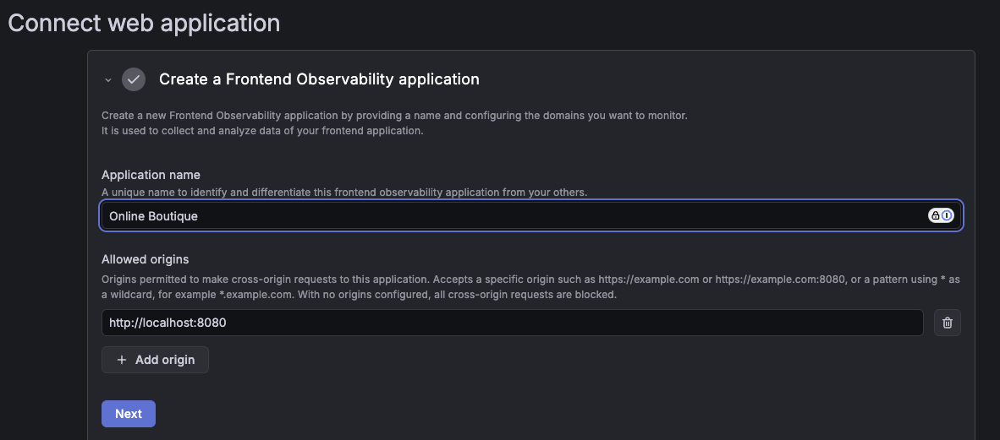
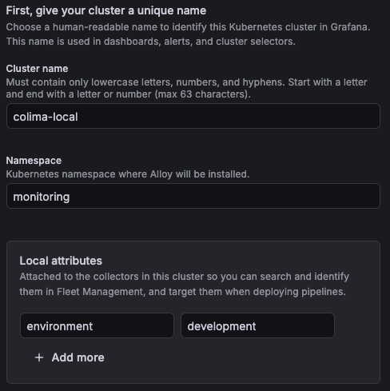

# Online Boutique Microservices DEMO Local Deployment Guide (monitored by Grafana™) - Colima

Deploy the complete GCP Online Boutique Microservices DEMO on your MacBook Mx using Colima and monitor it with Grafana Cloud Observability
https://github.com/googlecloudplatform/microservices-demo
All credit goes to the maintainers of that repo.

## Why another application DEMO for Grafana?

Good question, I challenge you to find a DEMO that works out of the box without too much hassle, this Tech stack can be set up in 7-10 minutes depending on how fast you can configure the RUM step and the Fleet Management, then you can start playing with Grafana Cloud, and that's the main use case here, start using Grafana Cloud right away.

And to be honest... people are more interested in buying clothes and accessories, plus, in my opinion, this a most interesting project from the technical side, it has more microservices and things to show on a DEMO.

Side note: After creating this DEMO I realized that it actually can work for you, the person who don't need to present anything!
Yes, you can use it to deploy the Tech stack and play with Grafana Cloud, get the feeling about our product and at later stage try Grafana Cloud for your Production projects, even the ones you have at Home!.

**DISCLAIMER:** This project is far from perfect and it worked for my use case, if you see that you can contribute to make it better, please create an issue or PR.
I created this DEMO because I needed to showcase Grafana Cloud features in my Grafana Labs interview process.


## Requirements

This setup has been optimized to get the most out of a M1 Macbook with limited resources and has been tested on other Mx.
It will be nice if you have some experience with Kubernetes, microservices, etc. if that's not the case, no worries, I hope this project can help you setup a successful DEMO without too much effort.

Minimum requirements to run the Colima cluster.

- **CPU**: 6 cores
- **Memory**: 8GB RAM
- **Disk**: 20GB free space

## Pre-requisites

### 0. Get your Free Forever Grafana Cloud account

Yes, free! this DEMO was created using the Free tier.
https://grafana.com/products/cloud/

### 1. Install Colima
```bash
brew install colima
```
Or download from: https://github.com/abiosoft/colima

### 2. Install kubectl
```bash
brew install kubectl
```
Or download from: https://kubernetes.io/docs/tasks/tools/

### 3. Install Helm
```bash
brew install helm
```
Or download from: https://helm.sh/docs/intro/install/

## Quick Start (7-10 Minutes)

### Setup Online Boutique frontend monitoring

Do this first! For Frontend monitoring.

Go to Observability->Frontend and "Create New"

- Name: Online Boutique
- Allowed Origins: http://localhost:8080



Select Manual instrumentation and copy-paste the Faro URL to your `.env` file i.e. `https://faro-collector-prod-eu-west-0.grafana.net/collect/randomstring`

Click "Continue" until Step 4 and select any alert if you want. 

### Alloy Connector

- Go Connections->Fleet Management and click "Add Collector"
- Select Alloy,  Kubernetes as platform and click Next
- Create a new token and save it on some place as it will not show again, click Next.
- Select "Lightweight - Quick start", click Next
- Remote monitoring as it's and click Next
- Now, this is important, as this is the data you need for your `.env` file:



All information required for the `.env` file is located inside the "Deployment code to copy"
*IMPORTANT!*
LEAVE the page as it is, don't close it or do anything until you copy all that info and then proceed to install the DEMO, after installing the DEMO try the "Test connection" button, that will add the collector to Fleet Management.

### Step 1: Start Colima
Start Colima with Kubernetes
```bash
colima start --cpu 6 --memory 8 --kubernetes
```

Verify it's running
```bash
kubectl cluster-info
```

If you fancy, install K9s...

### Step 2: Deploy Everything
Run the all-in-one deployment script
```bash
./deploy-all-in-one-local.sh
```

**What it deploys**:
- ✅ Grafana Collector
- ✅ Online Boutique (11 microservices)
- ✅ Load Generator (5 concurrent users)
- ✅ ~17 pods total
- ✅ ~3-4GB memory usage

**Deployment time**: 5-7 minutes

*IMPORTANT*
Now is a good time to click the "Test connection" button on the new Collector in Fleet Management.

### Step 3: Access the Application
```bash
# Port forward to access the frontend
kubectl port-forward -n boutique svc/frontend 8080:80

# Open in browser
open http://localhost:8080
```

### Step 4: Run Demo Scenarios
Simulate failures for demo
```bash
./simulate-errors.sh
```

### Step 5: Monitor in Grafana Cloud
- Open your Grafana Cloud instance
- Go to Explore
- **Cluster name**: `colima-local`
- **Namespace**: `boutique`

But, the deployment script enables an Executive Dashboard.
```
"View it at: https://${GRAFANA_STACK}.grafana.net${DASHBOARD_URL}"
```

## Cleanup

Use the `uninstall.sh` script.

## Performance Tips

### Reduce Resource Usage
1. **Scale down services**:
   ```bash
   kubectl scale deployment adservice -n boutique --replicas=0
   kubectl scale deployment recommendationservice -n boutique --replicas=0
   ```

2. **Reduce load generator**:
   ```bash
   kubectl set env deployment/loadgenerator -n boutique USERS=2
   ```

3. **Disable logs collection**:
   ```bash
   helm upgrade grafana-k8s-monitoring grafana/k8s-monitoring \
     --namespace grafana-stack --reuse-values \
     --set podLogs.enabled=false
   ```

### Increase Performance
1. **Allocate more resources to Colima**:
   ```bash
   colima stop
   colima start --cpu 8 --memory 12 --kubernetes
   ```

2. **Use faster disk**:
   - Ensure Colima is on SSD
   - Check with: `colima status`

## What's Included

### Grafana Alloy Stack

Metrics, Logs, Traces, Profiling and RUM (yes, included!)

**Resource usage**: ~400MB RAM total

### Online Boutique Services
1. frontend
2. cartservice
3. productcatalogservice
4. currencyservice
5. paymentservice
6. shippingservice
7. emailservice
8. checkoutservice
9. recommendationservice
10. adservice
11. redis-cart

**Resource usage**: ~2.5GB RAM total

### Load Generator
- Simulates 5 concurrent users
- Generates continuous traffic
- Creates traces for testing

**Resource usage**: ~100MB RAM

## Resource Optimization

The deployment is optimized for local use

### Disabled Features
- ❌ OpenCost (not needed locally)
- ❌ Kepler (power monitoring)

## Monitoring

### Environment Filtering

**Distinguish between environments in Grafana Cloud**:

In case you deploy more environments.

| Environment | Cluster Name | Filter |
|-------------|--------------|--------|
| Local (Colima) | `colima-local` | `cluster="colima-local"` |

**Example queries with environment filter**:

```promql
# Local environment only
sum by (service_name) (rate(traces_span_metrics_calls_total{cluster="colima-local"}[5m]))

# Compare environments
sum by (cluster, service_name) (rate(traces_span_metrics_calls_total[5m]))
```

### Span Metrics (Automatic RED Metrics)
```promql
# Request rate by service (local cluster)
sum by (service_name) (rate(traces_span_metrics_calls_total{cluster="colima-local"}[5m]))

# Error rate by service (local cluster)
sum by (service_name) (rate(traces_span_metrics_calls_total{cluster="colima-local", http_status_code=~"5.."}[5m]))

# P95 latency by service (local cluster)
histogram_quantile(0.95, sum by (service_name, le) (rate(traces_span_metrics_duration_milliseconds_bucket{cluster="colima-local"}[5m])))
```

### Logs
```logql
# All errors
{namespace="boutique"} |= "error"

# Specific service
{namespace="boutique", app="frontend"} |= "error"
```

### Traces
```
# Failed traces
status=error

# Slow traces
duration>5s

# Specific service
service.name="frontend"
```

## Useful Commands

### Check Status
```bash
# All pods
kubectl get pods -A

# Boutique pods
kubectl get pods -n boutique

# Grafana stack pods
kubectl get pods -n grafana-stack

# Watch pods
kubectl get pods -n boutique -w
```

### View Logs
```bash
# Frontend logs
kubectl logs -n boutique -l app=frontend --tail=50 -f

# Alloy receiver logs
kubectl logs -n grafana-stack -l app.kubernetes.io/name=alloy-receiver --tail=50 -f

# All boutique logs
kubectl logs -n boutique --all-containers=true --tail=50
```

### Restart Services
```bash
# Restart all boutique services
kubectl rollout restart deployment -n boutique

# Restart specific service
kubectl rollout restart deployment frontend -n boutique

# Restart Alloy
kubectl rollout restart daemonset -n grafana-stack
```

### Resource Usage
```bash
# Top pods
kubectl top pods -n boutique

# Top nodes
kubectl top nodes

# Describe pod
kubectl describe pod -n boutique <pod-name>
```

## Troubleshooting

### Pods Not Starting
```bash
# Check events
kubectl get events -n boutique --sort-by='.lastTimestamp'

# Check pod status
kubectl describe pod -n boutique <pod-name>

# Check logs
kubectl logs -n boutique <pod-name>
```

**Common issues**:
- Insufficient memory → Increase Colima memory
- Image pull errors → Check internet connection
- CrashLoopBackOff → Check logs for errors

### No Metrics in Grafana Cloud
```bash
# Check Alloy receiver is running
kubectl get pods -n grafana-stack -l app.kubernetes.io/name=alloy-receiver

# Check Alloy logs
kubectl logs -n grafana-stack -l app.kubernetes.io/name=alloy-receiver --tail=100

# Verify span metrics config
kubectl get configmap grafana-k8s-monitoring-alloy-receiver -n grafana-stack -o yaml | grep spanmetrics
```

**Wait time**: Span metrics appear in 2-3 minutes after first traces

### High Memory Usage
```bash
# Check memory usage
kubectl top pods -A

# Reduce load generator users
kubectl set env deployment/loadgenerator -n boutique USERS=2

# Scale down services
kubectl scale deployment cartservice -n boutique --replicas=0
```

### Colima Issues
```bash
# Restart Colima
colima stop
colima start --cpu 6 --memory 8 --kubernetes

# Check Colima status
colima status

# View Colima logs
colima logs
```

## Architecture

```
┌────────────────────────────────────────────────────┐
│               Colima (6 CPU, 8GB RAM)              │
├────────────────────────────────────────────────────┤
│                                                    │
│  ┌──────────────────────────────────────────────┐  │
│  │  Kubernetes Cluster                          │  │
│  │                                              │  │
│  │  ┌──────────────┐  ┌──────────────────────┐  │  │
│  │  │ grafana      │  │      boutique        │  │  │
│  │  │ collector    │  │                      │  │  │
│  │  │ • alloy-*    │  │ • 11 microservices   │  │  │
│  │  │ • kube-state │  │ • load generator     │  │  │
│  │  │ * etc        │  │ • ~2.5GB RAM         │  │  │
│  │  │ ~400MB RAM   │  │                      │  │  │
│  │  └──────┬───────┘  └──────────┬───────────┘  │  │
│  │         │                     │              │  │
│  │         └─────────┬───────────┘              │  │
│  │                   │                          │  │
│  └───────────────────┼──────────────────────────┘  │
│                      │                             │
└──────────────────────┼─────────────────────────────┘
                       │
                       ▼
              ┌─────────────────┐
              │  Grafana Cloud  │
              └─────────────────┘
```

- **Total deployment/configuration time**: ~7-10 minutes
- **Total resource usage**: ~3-4GB RAM, ~2GB disk
- **Ready for demo**: Immediately after deployment